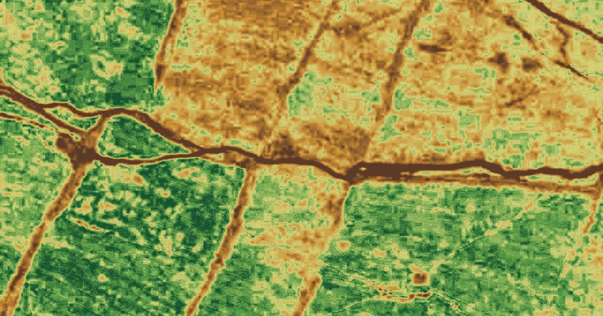

# Mintesnot Berhanu Tilahun — personal website

**Live site:** https://minteb.github.io/Minte/

Personal and academic website of **Mintesnot Berhanu Tilahun**, PhD candidate in Geospatial Science at Addis Ababa University (School of Earth Sciences) and geospatial consultant. The site covers UAV and satellite remote sensing for crop mapping and smallholder yield estimation in Ethiopia, along with publications, experience, talks and a project gallery.



## What's on the site

- **Fieldwork** — the 2026 eBee X multispectral UAV campaign (ADD-IN Ethiopia, CGIAR SPIA): launch video, field photos and campaign posts.
- **About** — research focus, supervisors, partners and skills.
- **Research** — filterable list of projects: UAV surveys, EO-based maize mapping (ViSTA), CropWatch/ETWatch training, cartography, LiDAR and SpatialWise training.
- **Publications** — journal articles, conference papers and technical reports.
- **Experience, education, talks** — timeline of roles and events.
- **Gallery** — maps, fieldwork, conferences, LiDAR and reports, with a lightbox viewer.
- **Contact** — email, LinkedIn, Google Scholar, ORCID and CV download.

## Repository structure

```
index.html                 the whole site (HTML, CSS and JS in one file)
Mintesnot_Berhanu_CV.pdf   CV linked from the site (add this file)
assets/
  field/                   2026 UAV campaign photos + greenness index image
  img/                     maps, conference, LiDAR and report images
  video/                   eBee X launch video and poster frame
  og-image.jpg             preview image for social media links
```

## Updating the site

- **Add a photo to the gallery:** put the image in `assets/img/` (or `assets/field/`), then copy one `<figure>` block inside `#gallery-grid` in `index.html` and change `data-src`, `src`, `alt` and the caption. `data-cat` sets the filter (`field`, `maps`, `conf`, `lidar`, `docs`).
- **Add a publication:** copy one `<li class="pub">` block in the Publications section.
- **Add a LinkedIn post:** copy one `<article class="dispatch">` block in the Fieldwork section.
- Keep images under ~300 KB (about 1600 px wide) and videos under ~10 MB so the site loads quickly on mobile connections.

Changes pushed to `main` go live on GitHub Pages within a minute or two.

## Contact

- Email: minteb11@gmail.com
- LinkedIn: https://www.linkedin.com/in/mintesnot-birhanu-378061217/
- Google Scholar: https://scholar.google.com/citations?user=k9OFg1MAAAAJ
- ORCID: https://orcid.org/0000-0002-9547-9434

© Mintesnot Berhanu Tilahun. Photos, video and maps are the author's own; please ask before reusing them.
